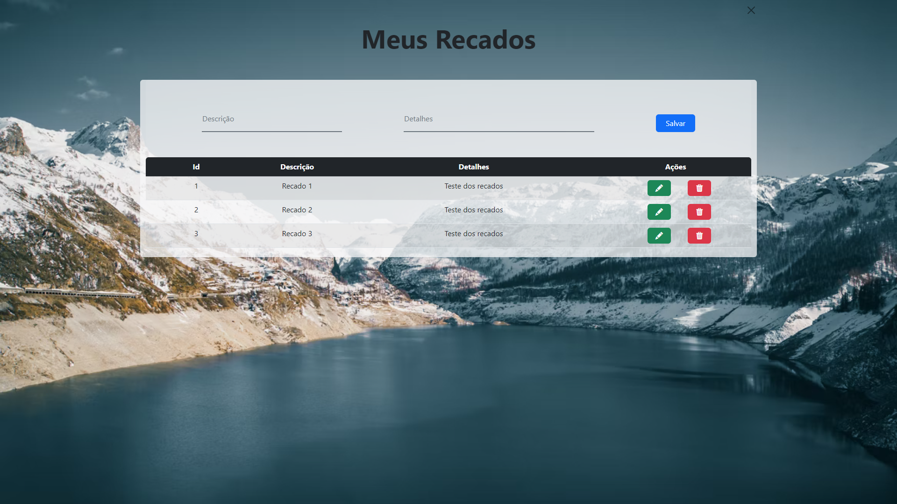
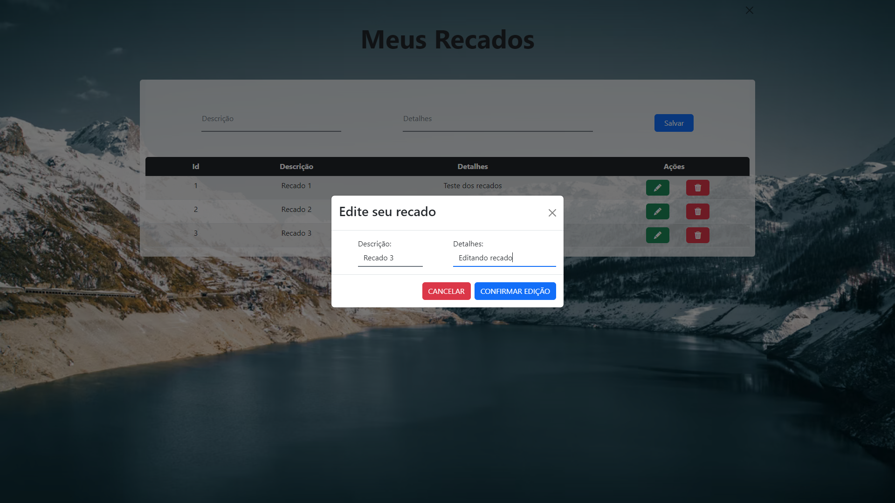

<h1>Avaliação Final do Módulo Front End II - Growdev</h1>

<h2>Melhorando o sistema de gerenciamento de recados.</h2>
 

<b>O que é o sistema de recados?</b>

Usuário pode criar seu perfil, fazer login e salvar, editar e/ou apagar seus recados.

<b>Tecnologias utilizadas:</b>

<ul>
<li> HTML 5</li>
<li> CSS 3</li>
<li> Bootstrap 5.2</li>
<li> Typescript 4.7.3</li>
</ul>

<b>Melhorias nessa versão:</b>

Utilizados os conceitos de Flexbox, Grid, Animations, e recursos do Bootstrap como: Modal, Inputs, Tables etc.

<b>Como usar:</b>

Faça login no Sistema de recados

Caso não ainda não possua conta, faça o seu cadastro:

Você pode ler, salvar, editar e apagar seus recados:

Edite suas mensagens:

